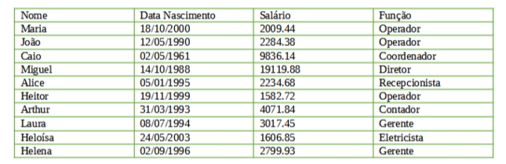

# Teste Prático INIFLEX

## Descrição

Este é um projeto para explicar a resolução do teste prático.

## Tabela de Conteúdos

- [Instalação](#instalação)
- [Sobre o Teste Prático](#teste)
- [Resolução](#resolução)
- [Autor](#autor)

## Instalação

Para instalar e configurar o projeto, siga os passos abaixo:

1. Clone o repositório:
   ```sh
   git clone git@github.com:ErickDS-dev/TestePratico-INIFLEX.git


## Teste

TESTE PRÁTICO PROGRAMAÇÃO.

Considerando que uma indústria possui as pessoas/funcionários como mostra a tabela abaixo:



Diante disso, você deve desenvolver um projeto java, com os seguintes requisitos:

1 – Classe Pessoa com os atributos: nome (String) e data nascimento (LocalDate).<br>
2 – Classe Funcionário que estenda a classe Pessoa, com os atributos: salário (BigDecimal) e função (String).<br>
3 – Deve conter uma classe Principal para executar as seguintes ações:<br>
3.1 – Inserir todos os funcionários, na mesma ordem e informações da tabela acima.<br>
3.2 – Remover o funcionário “João” da lista.<br>
3.3 – Imprimir todos os funcionários com todas suas informações, sendo que:<br>
• informação de data deve ser exibido no formato dd/mm/aaaa;<br>
• informação de valor numérico deve ser exibida no formatado com separador de milhar como ponto e decimal como vírgula.<br>
3.4 – Os funcionários receberam 10% de aumento de salário, atualizar a lista de funcionários com novo valor.<br>
3.5 – Agrupar os funcionários por função em um MAP, sendo a chave a “função” e o valor a “lista de funcionários”.<br>
3.6 – Imprimir os funcionários, agrupados por função.<br>
3.8 – Imprimir os funcionários que fazem aniversário no mês 10 e 12.<br>
3.9 – Imprimir o funcionário com a maior idade, exibir os atributos: nome e idade.<br>
3.10 – Imprimir a lista de funcionários por ordem alfabética.<br>
3.11 – Imprimir o total dos salários dos funcionários.<br>
3.12 – Imprimir quantos salários mínimos ganha cada funcionário, considerando que o salário mínimo é R$1212.00.<br>

Orientações gerais:<br>
• você poderá utilizar a ferramenta que tem maior domínio (exemplos: eclipse, netbeans etc);<br>
• Esperamos que você use todo seu conhecimento e criatividade nesse teste.<br>
• Caso você não souber resolver determinado requisito comente no código que aquele item você não sabe como desenvolver, e vá para o próximo. Avaliaremos o que você conseguiu desenvolver e como foi desenvolvido.<br>


## Resolução

• Para resolver o desafio foi utilizado a linguem Java na versão 8 (escolhida pelo o uso notório no mercado).<br>
• Utilizei a ide Intelij Ultimate sem mavem ou gradle (apenas o disponibilzado pela ide)<br>
• A fonte de pesquisa foi a documentação da Linguagem [Documentação do Java SE 8](https://docs.oracle.com/javase/8/docs/)<br>
• Foi utilizado o chat GPT para auxiliar a gerar metódos e explicar alguns tópicos do Collections no Java<br>
• Devido a condição atual no meu trabalho disponibilei apenas parte das minhas noites para a execução da tarefa, por isso a demora.<br>

IMPORTANTE:<br>
• No 3.6 ao imprimir os funcionários agrupados por função tomei a liberdade de organizar a lista para imprimiir de forma alfabetica de acordo com a função, pois no exercicio não menciona nada a respeito.
• Também após imprimir na primeira vez todos os dados ao fazer as próximas impressões na tela resolvi colocar apenas os nomes ou argumentos que sejam relevante para evitar imprimir todos os dados novamente.
• Este teste está privado


## Autor

Desenvolvedor - )
